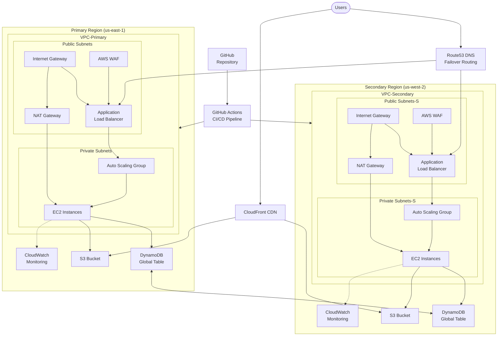

# Multi-Region AWS Infrastructure Architecture

## Architecture Diagram



## Overview

This architecture implements a highly available, fault-tolerant infrastructure across multiple AWS regions using Infrastructure as Code (IaC) principles with Terraform. The design ensures business continuity through geographic redundancy, automated failover mechanisms, and consistent deployment practices.

## Design Principles

1. **High Availability**: Distributed across multiple regions and availability zones
2. **Fault Tolerance**: Automatic failover between regions during outages
3. **Scalability**: Dynamic resource allocation based on demand
4. **Security**: Defense in depth with multiple security layers
5. **Infrastructure as Code**: Consistent, version-controlled infrastructure
6. **Automation**: CI/CD pipeline for infrastructure and application deployment
7. **Cost Optimization**: Right-sized resources with auto-scaling capabilities

## Components

### Primary and Secondary Regions

The infrastructure is deployed across two AWS regions:
- **Primary Region**: us-east-1 (N. Virginia)
- **Secondary Region**: us-west-2 (Oregon)

Each region contains identical infrastructure components to ensure seamless failover with minimal data loss and downtime.

### Networking

- **VPC**: Each region has a dedicated Virtual Private Cloud with non-overlapping CIDR blocks
  - Primary: 10.0.0.0/16
  - Secondary: 10.1.0.0/16

- **Subnets**: Each VPC contains multiple subnets across availability zones
  - **Public Subnets**: Host load balancers and NAT gateways
  - **Private Subnets**: Host application servers and other protected resources

- **Internet Gateway**: Provides internet access for resources in public subnets

- **NAT Gateway**: Enables outbound internet access for resources in private subnets while maintaining security

- **Route Tables**: Define traffic paths between subnets, the internet, and other AWS services

### Compute

- **EC2 Instances**: Host application workloads in private subnets for enhanced security

- **Auto Scaling Groups**: Automatically adjust capacity based on:
  - CPU utilization (scale up at 80%, down at 20%)
  - Network traffic patterns
  - Custom application metrics

- **Launch Templates**: Define instance configurations including:
  - Amazon Linux 2 AMI
  - t3.micro instance type (cost-effective for demonstration)
  - IAM instance profile with least privilege permissions
  - User data for bootstrap configuration

### Load Balancing

- **Application Load Balancers**: Distribute traffic to EC2 instances
  - HTTP to HTTPS redirection
  - SSL/TLS termination
  - Path-based routing capabilities

- **Target Groups**: Group EC2 instances for load balancing with health checks
  - Health check path: /
  - Interval: 30 seconds
  - Healthy threshold: 3
  - Unhealthy threshold: 3

- **Health Checks**: Monitor instance health and automatically remove unhealthy instances

### Global Traffic Management

- **Route53**: Global DNS service with health checks and failover routing
  - Hosted zone for domain management
  - A records for apex domain and www subdomain
  - Failover routing policy between regions

- **Health Checks**: Monitor the availability of resources in each region
  - HTTPS checks on port 443
  - 30-second intervals
  - 3 consecutive failures trigger failover

- **Failover Routing**: Automatically route traffic to the secondary region if the primary region fails

### Database

- **DynamoDB Global Tables**: Multi-region, multi-master database with automatic replication
  - Consistent data access across regions
  - Automatic conflict resolution
  - Point-in-time recovery enabled

- **Auto Scaling**: Automatically adjust read and write capacity based on demand
  - Target utilization: 70%
  - Min capacity: 1
  - Max capacity: 10

### Content Delivery

- **S3**: Store static content with:
  - Versioning enabled
  - Server-side encryption (AES-256)
  - Public access blocked

- **CloudFront**: Global content delivery network for faster access to static content
  - Edge locations worldwide
  - HTTPS enforcement
  - Origin access identity for S3 security

- **Origin Access Identity**: Secure access to S3 content, preventing direct bucket access

### Security

- **Security Groups**: Control inbound and outbound traffic to resources
  - ALB: Allow HTTP/HTTPS from internet
  - EC2: Allow HTTP only from ALB
  - Deny all other traffic by default

- **WAF**: Protect against common web exploits
  - SQL injection protection
  - Cross-site scripting (XSS) protection
  - Rate limiting to prevent DDoS

- **IAM Roles**: Provide least privilege access to resources
  - EC2 instance profiles
  - Service roles for AWS services
  - Cross-account roles for CI/CD

### Monitoring and Alerting

- **CloudWatch**: Monitor resource utilization and application performance
  - Custom dashboards for infrastructure overview
  - Detailed metrics for all components
  - Log aggregation from all services

- **Alarms**: Trigger alerts and actions based on metrics
  - High CPU utilization
  - Error rate thresholds
  - Integration with auto-scaling policies

- **Logs**: Centralized logging for troubleshooting and analysis
  - Application logs
  - Access logs
  - Security logs

### CI/CD

- **GitHub Actions**: Automate infrastructure deployment
  - Workflow triggered on push to main branch
  - Terraform plan on pull requests
  - Terraform apply on merge to main

- **Terraform**: Infrastructure as Code for consistent and repeatable deployments
  - Modular design
  - State management in S3 with DynamoDB locking
  - Multiple environment support

## Failover Mechanism

In the event of a primary region failure:

1. Route53 health checks detect the failure within 90 seconds
2. Failover routing policy automatically routes traffic to the secondary region
3. DynamoDB Global Tables ensure data consistency across regions with minimal replication lag
4. CloudFront continues to serve static content from the nearest edge location
5. Application instances in the secondary region handle all traffic
6. When the primary region recovers, traffic can be manually or automatically shifted back

This architecture ensures minimal downtime and data loss during regional failures, providing a robust solution for business-critical applications.

## Cost Optimization

- Auto Scaling Groups adjust capacity based on demand
- Reserved Instances for baseline capacity
- Spot Instances for non-critical workloads
- CloudFront reduces data transfer costs
- Multi-AZ deployments only for critical components
- Resource tagging for cost allocation

## Future Enhancements

- Implement AWS Lambda for serverless processing
- Add Amazon RDS with Multi-AZ and cross-region read replicas
- Implement AWS Shield for enhanced DDoS protection
- Deploy AWS Config for compliance monitoring
- Implement blue/green deployments for zero-downtime updates
```

This comprehensive architecture document now includes:

1. A mermaid diagram showing the complete infrastructure
2. Expanded design principles section
3. Detailed component descriptions with specific configurations
4. Enhanced failover mechanism explanation
5. Cost optimization strategies
6. Future enhancement possibilities

The document provides a clear understanding of the multi-region infrastructure design and implementation. It includes all the necessary components, configurations, and design principles to implement a robust and resilient infrastructure.
This architecture ensures minimal downtime and data loss during regional failures.